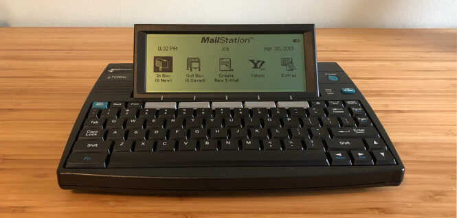
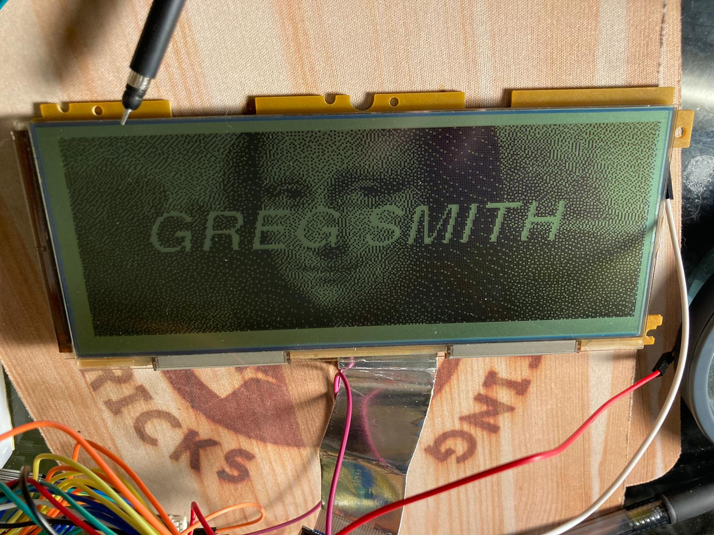

# Mailstation-Display

- Greg Smith
- 6/8/2022

## Intro

The Mailstation is a late 1990s device developed for the express purpose of sending emails over telephone lines. More info here: [Mailstation on Wikipedia](https://en.wikipedia.org/wiki/Cidco_MailStation)

While there is a lot of hobbiest interest in the device as a Z80 developer platform, my interest is in rehabilitating it with a modern CPU. The Z80 microprocessor and the associated hardware and firmware inside the Mailstation are quite elegant in design. But it cannot access Bluetooth or WiFi without additional hardware and firmware. See [Josh Stein's](https://jcs.org/2021/04/23/wifistation "Josh Stein") wonderful work. 

I intend to put a Raspberry Pi inside and drive the LCD display and keyboard directly. The first step is to take control of the LCD and drive it with the RPi's GPIO pins. There is a good deal of information in Kris Bahnsen's Github [kbembedded/mailstation](https://github.com/kbembedded/mailstation "Kris Bahnsen kbembedded/mailstation GitHub"). In particular I was lucky to find this information on the display in his Wiki: [Mailstation LCD Information](https://github.com/kbembedded/mailstation/wiki/LCD-Information)

The pinouts are mostly correct, but there is no information on the timing of the control pins. I spent about a week experimenting with the LCD to dtermine the right pinouts, and how to program the control pins to generate a display.

## Files

* `lcd.py` - a module that you can import into your Python program to control the LCD.
* `example.py` - a set of examples that call `lcd.py`
* `dotmat5x7.py` - a 5x7 dot matrix for drawing text on the LDC
* `images/` - a folder with a couple images to display
* `sounds/` - a folder with a few sounds
* `pix/` - a folder for pictures used n this README.md file

## lcd.py functions

These functions are serviceable, but I've found them to be a bit slow. I offer them more as documentation on how to access and update the LCD, rather than production software.

* Low-level functions
    * lcd.setup(delay=0, isBuffered=True) - initializes the RPi GPIO pins. Delay allows a used delay after control pins are pulled low (to allow them to settle in). isBuffered turns off/on buffering.
    * lcd.teardown() - restore the RPI GPIO pins
    * lcd.select_column(col) - selects a column (0-39) for read/write
    * lcd.read_byte(row, col=None) - reads a byte from the display (col is optional if lcd.select_column was just called)
    * lcd.write_byte(byte, row, col=None) - writes a byte to the display (col is optional if lcd.select_column was just called. row is 0-255, but the display is active only from 0x38-0xb7. Be sure to use 0x38-0xb7 if you want to see the results). Rows start on the lower-left and increase going "up" the display.
* Pixel-level functions
    * lcd.set_pixel(x, y, bit) - sets a pixel on the display. (0,0) = lower left corner
    * lcd.get_pixel(x, y) - gets a pixel from the display. (0,0) = lower left corner
* Screen-level functions
    * lcd.clear_screen(oddByte=0x00, evenByte=None) - clears the screen to zeroes. Or if oddbyte is specified, clears the screen to that value. And if both oddByte and evenByte are supplied, then the screen alternates with those values (eg: 0x55, 0xaa gives a checkerboard pattern).
    * lcd.print_at(x, y, s, width=None) - prints text at (x,y). If width is not specified, it uses 8-bits per character (40 characters wide.) The character dot matrix is 5x7, so specifying width=5 gives a nice mono-space of up to 53 characters (with a single blank pixel between characters). Specifying width=0 creates a proportionally spaced font of up to 64 characters across.
    * lcd.display_image(image_array) - loads the display with all the bytes in the supplied array. The array is organized in column-major form as arr[128][40].
    * lcd.read_image() - (unimplemented) - reads the display
* Buffering functions
    * for performance reasons, it is better to buffer the writes to the display and then repaint the entire display all at once.
    * lcd.setup() - turns buffering on by default.
    * lcd.defer(True) - begins buffering in the background. All display operations are written / read from internal RPi / Python memory.
    * lcd.defer(False) - flushes the internal RPi / Python buffer to the display in one operation.

## Hardware

The LCD display is organized as 320x128 pixels. It is actually 2 LCDs of 160x128 pixels glued together. The power inputs are 5VDC.The 8-bit Data, 8-bit Address, and control pins operate at TTL levels (5VDC). There is also a pin for the contrast which is controlled by a 10K-ohn variable resistor. (The markings on it say 1MEG, but that's incorrect. Ohm-meter readings indicate it runs up to 10K). The variable resister is tied to ground and the other end is tied to Pin 2 of the LCD.

### Memory

Internally, the device has 256 x 40 x 8-bits of memory for a total of 10,240 bytes. It's all completely addressable for both read and write. The display starts at address 0x38 and continues through 0xB8. As has been posted in `kbembedded`'s Wiki, one might use the addtional memory for storage.

I suspect that the actual memory is closer to 8192 bytes. Since there are 2 displays of 160x128, the total memory necessary is 160 x 128 / 8 = 2560 bytes per panel. Rounding up to the nearest power of two would be 4096 bytes each. And then multiply by two panels yeilds 8192 bytes.

### Pin out

I've duplicated `kbembedded`'s pinout diagram augmented with my RPi GPIO connections. The underscore (`_`) after the signal name indicates "active-low". These are the same names used in my Python code.

| Pin | Signal Name  | RPi GPIO |
|:---:|--------------|--------------|
| 1   | GND          |      GND        |
| 2   | Contrast     |      10K-pot tied to ground        |
| 3   | 5VDC IN        |    5VDC          |
| 4   | unknown output  |   N/A     |              |
| 5   | unknown input          |      N/A        |
| 6   | 5VDC IN  |  5VDC  |
| 7   | `LEFT_SEL_`    |  OUTPUT-20 |
| 8   | `COL_ADD_SEL_` |  OUTPUT-21   |
| 9   | `WRITE_`      |  OUTPUT-22            |
| 10  | `RIGHT_SEL_`   | OUTPUT-23  |
| 11  | A0           |  OUTPUT-02            |
| 12  | A1           |  OUTPUT-03             |
| 13  | A2           |  OUTPUT-04             |
| 14  | A3           |  OUTPUT-05             |
| 15  | A4           |  OUTPUT-06             |
| 16  | A5           |  OUTPUT-07             |
| 17  | A6           |  OUTPUT-08             |
| 18  | A7           |  OUTPUT-09             |
| 19  | D0           |  OUTPUT-11             |
| 20  | D1           |  OUTPUT-12             |
| 21  | D2           |  OUTPUT-13             |
| 22  | D3           |  OUTPUT-14             |
| 23  | D4           |  OUTPUT-15             |
| 24  | D5           |  OUTPUT-16             |
| 25  | D6           |  OUTPUT-17             |
| 26  | D7           |  OUTPUT-18             |
| 27  | GND          |  N/A            |
| 28  | GND          |  N/A            |

### Mystery Pins

I spent considerable time working out the meanings and uses of the signals on pins 3, 4, 5, and 6. 

* Original Assignments:
    * Signal-3 = "5.2V"
    * Signal-4 = "5V" 
    * Signal-5 = "5V"
    * Signal-6 = "Display Enable"

I worked with an oscilloscope and tried every permuation of these pins as inputs and outputs. Ultimately, I determined that Signal-3 and Signal-6 were 5VDC power inputs. The LCD display requires both to be wired to 5VDC. Neither would accomodate a TTL-level input to act as "Display Enable" (as orignially posted). I believe this is due to the low current supplied by the GPIO output pins. I also believe that each pin belongs to one half of the LCD display (which is two 160x128 LCDs glued together) and that there must be circuitry that requires both to be energized for the display to power on.

Signal-4 never dipped below 3.5V when viewed on the oscilloscope. Also, it seemed to fluctuate only when the device was being updated. I suspect that this is an output pin of some sort and my 'scope was picking up noise.

Likewise, Signal-5 kept to nearly 0.0V when viewed with the 'scope. It did pick up some noise when the display was being updated. I suspect this is either not connected or is an input of some sort.

I was hoping that Signal-4 and Signal-5 might be some sort of "Data Ready" output/input. But no amount of testing showed them as being available for that purpose. This would have been useful as I had many timing issues with the LCD display. The timing issues lead to random pixels turning on or off during update. A "Data Ready" input/output scheme might have solved these issues.

* Final Assignments:
    * Signal-3 = "5VDC IN"
    * Signal-4 = "unknown output" 
    * Signal-5 = "unknown input"
    * Signal-6 = "5VDC IN"

## Operation

### Overview

The timing of enabling the `LEFT_SEL_`, `RIGHT_SEL_`, `COL_ADD_SEL_`, and `WRITE_` pins took considerable experimantation. To write to the display you must first 'latch' the column select (0-19 on D0-7) pulling `_COL_ADD_SEL_` low, then address the row on A0-7, set the 8 pixels on D0-7, and then 'write' it by pulling the `LEFT_SEL_` or `RIGHT_SEL_` pins low while also pulling `WRITE_` low. Reading was similarly accomplished by a column select, addressing the row with A0-7, then pulling either `LEFT_SEL_` or `RIGHT_SEL_` low and reading the values on D0-7.

### `LEFT_SEL_` and `RIGHT_SEL_`

Since the display is split into two 160x128 pixel displays, a single row of pixels is organized as twenty 8-bit columns - selected by either the `LEFT_SEL_` or `RIGHT_SEL_` pins (denoting either the left or right LCD).

Note that these pins are "active low," which means they must be held high (5V) until either the left or right panel is selected. Note also, that you must not keep `LEFT_SEL_` or `RIGHT_SEL_` pulled low continuously. I thought I could pull one pin low and keep it low while updating the A0-7 and D0-7 pins and then do a `WRITE_` when I was ready. However, this creates random errors on the display. You must keep the `LEFT_SEL_` and `RIGHT_SEL_` pins high until the moment you decide to either read or write from the display.

### `COL_ADD_SEL_`

Before performing a read or write from the display, you must 'latch' in the column you wish to address. Note that if there were 5 more address pins one could address the column directly. But that would require at least 13 and possibly 14 address pins. To save on pinout, the address and data pins are "multiplexed" to allow a 2-step process to first select the column, then address the rows under that column with A0-7.

(Arguably, the three `LEFT_SEL_`, `RIGHT_SEL_` and `COL_ADD_SEL` pins might have been used as address bits. But I suspect the hardware limitations of using two LCD panels together required this design choice.)

The D0-7 pins are set to the column you want to address (0-19). Then the `WRITE_`, `COL_ADD_SEL_` and either the `LEFT_SEL_` or `RIGHT_SEL` pins are pulled low to 'latch' the value into the column select.

I noticed that when I did this the display would be corrupted with random data. I found that setting A0-7 to '0x00' fixed the problem. What I suspect is that the `WRITE_` enable actually writes to memory even though `COL_ADD_SEL_` was pulled low. I tried various combinations of `WRITE_` and `COL_ADD_SEL_` and the order in which they were enabled, but I *always* had to pull both pins low to latch the column select. So, the compromise is the set the A0-7 pins to 'row zero' which is off-screen. The column address is therefore both latched by the LCD and stored in row 0x00.

Next, all the enable pins must be pulled high. I experimented with leaving the `LEFT_SEL_` and `RIGHT_SEL_` low but that led to corrupted display reads and writes.

### `WRITE_`

The `WRITE_` select is pulled low once the column is selected and the A0-7 and D0-7 pins are set. It must be preceded by one of the `LEFT_SEL_` or `RIGHT_SEL_` pins being pulled low. Then all pins are pulled high and the data is written.

#### Reading the display

Since the display is backed by its own memory, it can be read as well as written to. This was necssary for such things as line drawing and rendering text.

This is accomplished by 'latching' in the column with `COL_ADD_SEL_` and then setting the A0-7 bits, setting the GPIO bits for D0-7 to inputs, than pulling the `LEFT_SEL_` or `RIGHT_SEL_` pins low. I then read the D0-7 bits, pulled `COL_SEL_` and the `LEFT_SEL_` and `RIGHT_SEL_` bits high.

See the section on `Spurious Display Read / Write Issues`. Ultimately, I used a buffering scheme that allowed reading from the RPi / Python memory rather than the display. It proved to be much more accurate.

### Timing and DELAY

The `lcd.setup()` function allows you to set a delay (in microseconds) between the time the enable pins are pulled low and then pulled high again. This worked well for debugging, but once I had other timing issues worked out, the delay had no advantages towards preventing display corruption and spurious writes to the display.

## Spurious Display Read / Write Issues

During experimentation, I found that the output would have spurious errors on the display. I thought it might be due to not having enough time for the enable pins to 'settle down' and added delays. After much study, I discovered that slowing the writing process down didn't fix the problem.

I believe that the LCD displays are not necessarily designed to be addressed in random access. But rather, in one operation from bottom to top.

This was confirmed when I started using buffers to store all the pixel reads/writes to memory (using `lcd.defer(True)`). Once I started writing the entire buffer to the display in one operation (using `lcd.defer(False)`), all my spurious errors were eliminated.